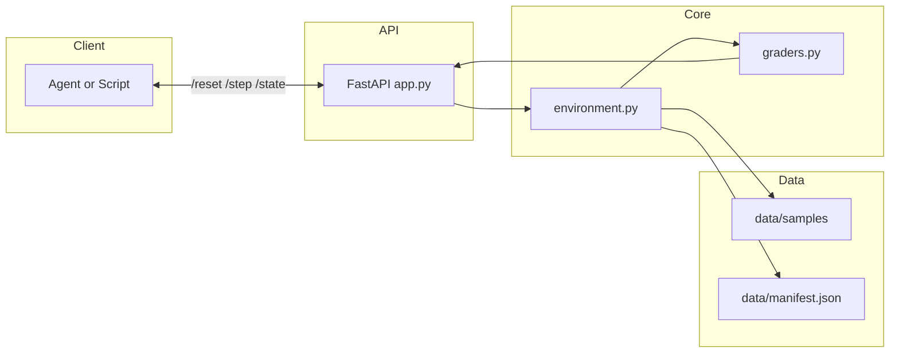
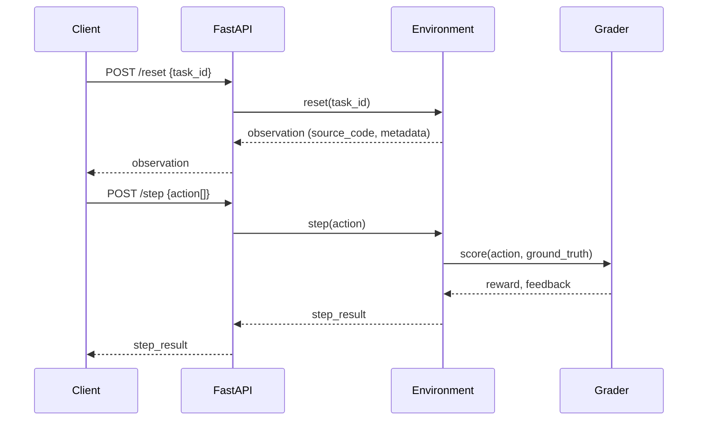
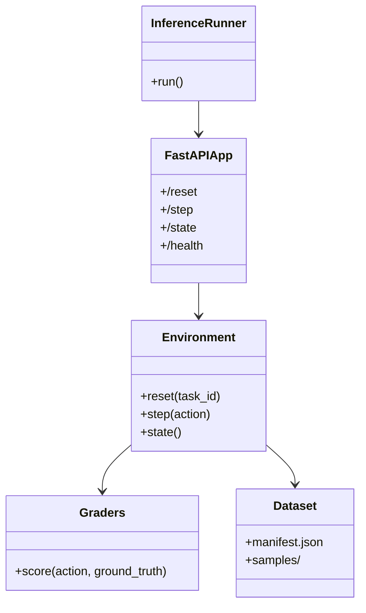
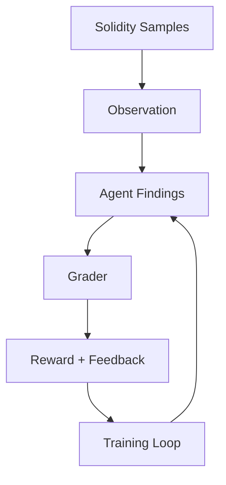

# SolidityGuard

SolidityGuard is an OpenEnv RL environment that trains agents to review Solidity smart contracts for best practices, gas optimizations, and security vulnerabilities. It provides a structured audit loop with reset/step/state APIs, a dataset of Solidity samples, and a reward function that scores findings quality.

## Architecture at a glance









## What the project does

- Curates Solidity contracts and exposes them as observations with task context.
- Accepts structured audit findings as actions.
- Scores findings with task-specific grading logic.
- Enables RL or heuristic agents to learn better auditing behavior.

## Task taxonomy

- Task 1 (Easy): Best practices and syntax issues
- Task 2 (Medium): Gas optimization opportunities
- Task 3 (Hard): Security vulnerabilities
- Task 4 (Hard): Comprehensive audit across categories

## How a single episode works

1. Client calls `/reset` with a task id.
2. Environment returns Solidity source and metadata.
3. Client submits a list of findings to `/step`.
4. Grader evaluates findings and returns reward + feedback.

## Environment specification

### Observation space
- `source_code`: Solidity code string
- `metadata`: contract name, compiler version, file path
- `task_id`: active task

### Action space
JSON array of findings:
```json
[
  {
    "issue_type": "reentrancy",
    "line_number": 13,
    "description": "State updated after external call",
    "severity": "Critical"
  }
]
```

## Quick start

### Requirements
- Python 3.11+
- `API_BASE_URL`, `MODEL_NAME`, `HF_TOKEN` environment variables (for LLM inference)

### Install
```bash
pip install -r requirements.txt
```

### Run API server
```bash
uvicorn app:app --host 0.0.0.0 --port 7860
```

### Run inference
```bash
python inference.py
```

### Expected output
Structured logs with `[START]`, `[STEP]`, and `[END]` tags. The final score is reported in the `[END]` log.

## API endpoints

### POST /reset
Reset environment and get a contract to audit.
```json
{"task_id": "task_1_best_practices"}
```

### POST /step
Submit audit findings and receive score.
```json
{"action": [{"issue_type": "reentrancy", "line_number": 13, "description": "...", "severity": "Critical"}]}
```

### GET /state
Get current environment state.

### GET /health
Health check endpoint.

## Files

- `openenv.yaml` - Environment spec
- `environment.py` - Core env logic (`reset/step/state`)
- `graders.py` - Reward logic and grading
- `data/manifest.json` - Dataset manifest
- `data/samples/` - Solidity contract samples
- `inference.py` - Baseline runner and logging
- `app.py` - FastAPI endpoints for reset/step/state
- `Dockerfile` - Container build

## Notes

- Runtime should stay under 20 minutes on 2 vCPU / 8 GB.
- Docker build must succeed for submission.
- Use Hugging Face Inference Providers for LLM inference.
